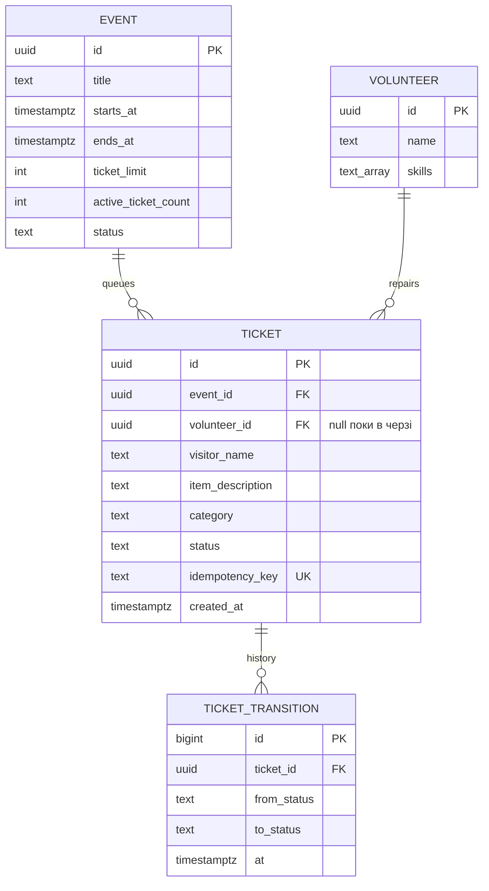

# Spec — Repair Café (лабораторні 1–2)

**Що і навіщо.** HTTP API черги ремонтів на сесіях Repair Café. Інваріанти: (I1) у кожної речі
в роботі рівно один майстер, і він уміє лагодити її категорію; (I2) майстер має ≤ 1 річ `in_repair`;
(I3) активних речей у сесії ≤ `ticket_limit`; (I4) повтор реєстрації не створює дубль, а той
самий ключ з іншим тілом відхиляється.

## 1. Модулі та межі

| Модуль               | Відповідальність                                   | Може залежати від                    |
| -------------------- | -------------------------------------------------- | ------------------------------------ |
| `modules/events`     | сесії кафе: час, ліміт черги, відкрита/закрита     | `shared`                             |
| `modules/volunteers` | майстри та їхні навички                            | `shared`                             |
| `modules/tickets`    | черга речей, взяття в роботу, машина статусів      | `shared`, API `events`, `volunteers` |
| `adapters`           | сховища в пам'яті та PostgreSQL                    | публічні API модулів, `shared`       |
| `platform`           | HTTP (Fastify), мапінг помилок, версія             | `shared`, API модулів                |
| `config`             | єдине місце читання `process.env`                  | —                                    |
| `shared`             | `DomainError`, `Id`, **`Category`** (спільне ядро) | —                                    |
| `app.ts`             | composition root                                   | усе                                  |

Всередині модуля: `domain.ts` (типи + чисті правила) → `service.ts` (сценарії) → `ports.ts`
(інтерфейси сховищ; реалізації — у `adapters`). **Правила меж:** (R1) інший модуль — лише через `index.ts`;
(R2) `domain.ts` залежить лише від `shared`; (R3) модулі не імпортують `platform`; (R4) `shared` — лист;
(R5) без циклів. Поняття, потрібне доменам двох модулів, живе в `shared`. Усе перевіряє `make deps`.

## 2. Дані

Статуси: `queued → in_repair → fixed | not_fixable | needs_parts`; `needs_parts → queued`;
`queued | needs_parts → withdrawn`. Активні = `queued | in_repair | needs_parts`. Записи не видаляються.

## 3. Як дані оновлюються

- **Зареєструвати річ** (`tickets.register`): у транзакції знайти глобальний `idempotency_key`;
  однаковий нормалізований запит повертає той самий тікет навіть після закриття сесії, інше тіло
  дає 409. Для нового ключа `events FOR UPDATE` перевіряє `open` і ліміт, після чого тікет та
  перший перехід записуються атомарно. UNIQUE та `active_ticket_count`/CHECK захищають прямі SQL-записи.
- **Взяти в роботу** (`tickets.claim`): у транзакції заблокувати тікет, потім майстра; перевірити
  навичку та дозволений перехід, відсутність іншої речі `in_repair`; оновити тікет і історію.
  Частковий UNIQUE на `volunteer_id WHERE status='in_repair'` захищає від конкурентного дубля.
- **Завершити** (`fixed`/`not_fixable`/`needs_parts`): лише призначений майстер; під блокуванням
  тікета оновити стан та історію. `fixed`/`not_fixable` звільняють місце в активній черзі;
  `needs_parts` зберігає місце, але звільняє майстра.

## 4. Критерії прийняття (Лаба 1)

- [x] AC1 Повний `npm run check` зелений: формат, лінт, типи, архітектура R1–R5, smoke, збірка. `make check` є обгорткою.
- [x] AC2 Брудний коміт блокується hook-ом — `scripts/hook-demo.sh` у Git Bash → `OK`. `make hook-demo` є обгорткою.
- [x] AC3 `GET /health` → 200; `GET /version` → поточний git sha.
- [x] AC4 Структура `src/` дорівнює таблиці §1; порушення меж ловить `make deps`.
- [x] AC5 Помилки домену — `DomainError` з кодом; HTTP-статус визначає лише `platform`. Перевірка: smoke-тест.

## 5. Сценарії Lab 2 та HTTP-контракт

| Сценарій           | Маршрут                                                                                         | Успіх                                                  | Помилки                                                                             |
| ------------------ | ----------------------------------------------------------------------------------------------- | ------------------------------------------------------ | ----------------------------------------------------------------------------------- |
| Реєстрація         | `POST /events/:id/tickets` з `Idempotency-Key` і `visitorName`, `itemDescription`, `category`   | 201 `queued`; той самий ключ/тіло — 200 з тим самим ID | 400 валідація, 404 сесія, 409 закрита сесія, `QUEUE_FULL`, `IDEMPOTENCY_KEY_REUSED` |
| Взяття             | `POST /tickets/:id/claim` з `volunteerId`                                                       | 200 `in_repair`                                        | 400 навичка, 404 тікет/майстер, 409 зайнятий майстер або недозволений перехід       |
| Завершення         | `POST /tickets/:id/complete` з `volunteerId`, `outcome` (`fixed`, `not_fixable`, `needs_parts`) | 200 з новим станом                                     | 404 тікет, 409 не призначений майстер або недозволений перехід                      |
| Додаткові переходи | `POST /tickets/:id/requeue`, `POST /tickets/:id/withdraw`                                       | 200                                                    | 404, 409                                                                            |
| Дошка сесії        | `GET /events/:id/queue`                                                                         | 200: усі тікети сесії за часом, із `volunteerName`     | 404 сесія                                                                           |
| Деталі             | `GET /tickets/:id`                                                                              | 200: тікет та історія переходів                        | 404                                                                                 |

`GET /health` — liveness; `GET /health/ready` — перевірка сховища. Відсутня БД або таймаут:
503 `UNAVAILABLE` і `Retry-After: 5`, без адреси БД у відповіді. `Idempotency-Key` — 8–100
друкованих ASCII-символів без пробілів; його унікальність глобальна для всіх сесій.

## 6. Схема та SQL-доступ

Схема версіонується в [migrations/](migrations/): `001_init.sql` створює `events`, `volunteers`,
`tickets`, `ticket_transitions`; `002_invariants.sql` додає частковий UNIQUE для одного
`in_repair` на майстра; `003_queue_capacity.sql` додає `events.active_ticket_count`, CHECK
`0 ≤ active_ticket_count ≤ ticket_limit` і тригер для активних статусів; `004_idempotency_key_format.sql`
перевіряє формат ключа. `tickets.idempotency_key` має UNIQUE, тікет має один `volunteer_id` і
незмінний `event_id`. Індекси `tickets(event_id, created_at)` та
`ticket_transitions(ticket_id, id)` підтримують дошку й історію.

У `READ COMMITTED` реєстрація тримає `events FOR UPDATE` до COMMIT, а claim/complete тримають
`tickets FOR UPDATE`; claim також блокує `volunteers`. Усі читання й рішення всередині цих
транзакцій; записи тікета й переходу комітяться разом. На `40P01` (deadlock) або `40001`
(serialization failure) повторюється **вся** транзакція щонайбільше тричі з backoff/jitter;
бізнес-конфлікти не повторюються. Повтор POST-реєстрації після невизначеного результату має
використовувати той самий ключ.

Дошка виконує сталу кількість запитів: перевірка сесії та один `SELECT tickets LEFT JOIN
volunteers`, а не запит для кожного тікета. `test/query-budget.test.ts` задає бюджет ≤ 2
клієнтських SQL-запитів для 1 і 15 тікетів.

## 7. Перевірка й межі

- [x] Той самий набір S1–S10/C1–C5 проходить на in-memory прототипі; окремо перевірено retry,
      ключ і повтор після закриття сесії.
- [x] Той самий набір та SQL-тести на реальному PostgreSQL: запуск тільки на окремій тимчасовій
      БД через `TEST_DATABASE_URL`; наявна БД `localhost:5432` не використовується для тестів.
- [x] SQL-обмеження, конкурентні сценарії та бюджет запитів перевірено на PostgreSQL 18.
- [x] 503/`Retry-After` перевірено при недоступному loopback-порту, а обмежені повтори deadlock/serialization — через контрольовані помилки тестового адаптера.
- [ ] Реальний дедлок PostgreSQL та відновлення після зупинки/перезапуску живої БД не перевірено.

Це навчальний API без автентифікації майстрів: `volunteerId` у запиті не доводить особу.
Постійні міграції в наявній БД потребують окремого плану й дозволу; тестовий fixture працює
лише з явно заданою ізольованою БД.
